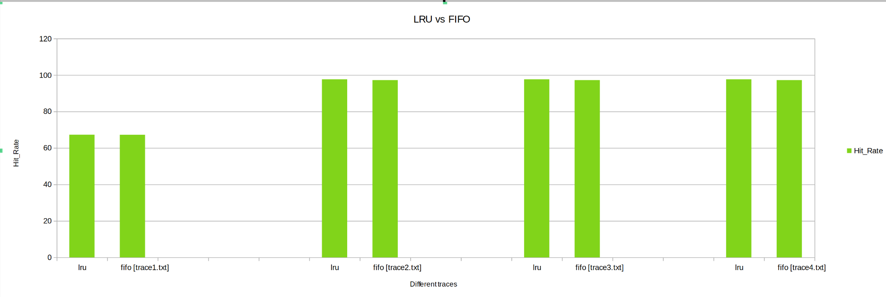

# COL216 LAB 3 
# CACHE SIMULATOR [ PART B ]

## Departmemt of Computer Science and Engineering, IIT Delhi

### Parth Verma - 2022CS11936

**The Cache Simulator was tested on multiple trace files, and was instantiated with differnt configuration , Results and observations from these tests are shared below**

# ASSOSIATIVITY 

### Description
Keeping the poilicies fixed (write_no_allocate, write back, LRU) the Cache was tested for 3 different combinations of cache size and set size. 
The test was meant to compare performance of caches with differnet assosiativities (Fully assosiative, Set assosiative, Direct Mapped)

### Observations
- **Hit Rate**: The Hit Rate increases as the assosiativity increases. 
- **Miss Penalty**: The Miss Penalty decreases as the asociativity increses.
- **Total Cycles**: The Total_Cycles decreases as the asociativity increses.
- **Cache Size**: THe Cache Size decreases as assosiativty increases.

From above we can conclude ,Fully assosiative cache performs much better than set assosiative and direct mapped cache.
But, Fully Assosiative Cache demands high amount of hardware therefore is not practically realizable for large caches.
Hence we conclude that Set assosiative is the best possible configuration among the above shown.

# LRU v/s FIFO

### Description
Keeping the other parameters fixed the Cahces was instantiated with LRU and then FIFO, Parameters like Hit Rate, Miss Penalty, Total Cycles were observed.

### Observations
- **Hit Rate**: The Hit Rate is almost equal for LRU and FIFO replacement policies. 
- **Miss Penalty**: The Miss Penalty is generally higher for FIFO than LRU.
- **Total Cycles**: FIFO takes high no of cycles as compared to LRU

From above we can conclude ,LRU cache performs much better than FIFO cache.

# WRITE_THROUGH v/s WRITE_BACK

### Description
Keeping the other parameters fixed the Cahces was instantiated with write_through and then write_back, Parameters like Hit Rate, Miss Penalty, Total Cycles were observed.

### Observations
- **Hit Rate**: The Hit Rate is almost equal for Write_Through and Write_Back modes. 
- **Miss Penalty**: The Miss Penalty is generally higher for Write_Through than Write_Back.
- **Total Cycles**: Write_through takes high no of cycles as compared to Write_Back.

From above we can conclude ,Write_Back cache performs much better than Write_through cache.

# WRITE_ALLOCATE v/s WRITE_NO_ALLOCATE

### Description
Keeping the other parameters fixed the Cahces was instantiated with write_allocate and then write_no_allocate, Parameters like Hit Rate, Miss Penalty, Total Cycles were observed.

### Observations
- **Hit Rate**: The Hit Rate is greater for Write_Allocate and Write_no_allocate modes. 
- **Miss Penalty**: The Miss Penalty is generally higher for Write_Allocate than Write_no_allocate.
- **Total Cycles**: Write_Allocate takes less no of cycles as compared to Write_no_allocate.

From above we can conclude ,Write_Allocate cache performs much better than Write_no_allocate.

# BLOCK SIZE

### Description
Keeping the other parameters fixed the Cahces was instantiated with varying block sizes to observe the trendin parameters like 
Hit Rate, Miss Penalty, Total Cycles, Cache Size.

### Observations
- **Hit Rate**: The Hit Rate inreases with Block Size.
- **Miss Penalty**: The Miss Penalty inreases with Block Size.
- **Total Cycles**: The Total Cycles inreases with Block Size.
- **Cache Size**: The Cache_Size inreases with Block Size.

From above we can conclude a Cache with a adequate block size not too large , not too small  
will perform best given tradeoff between high hit rate and low miss penalty.

# CONCLUSION

From above observation we conclude that the Cache with best performance should be 

(set assosiative,adequate Block Size (= 8 bytes), Write allocate, Write Back , LRU ).

The configuration has been chosen from the observation of the above experiments.
All the experimemts were run on 5 differnet trace file to maintain the versetalty.

